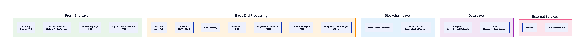
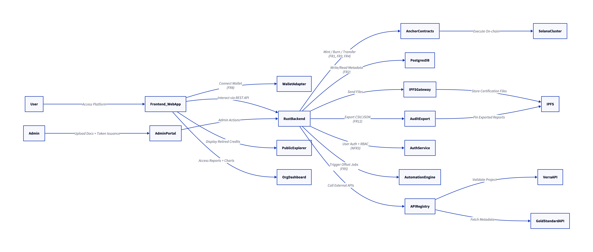
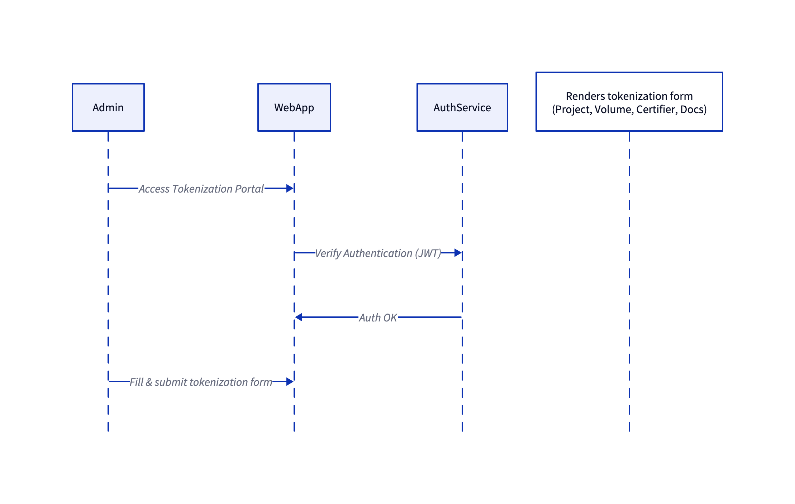
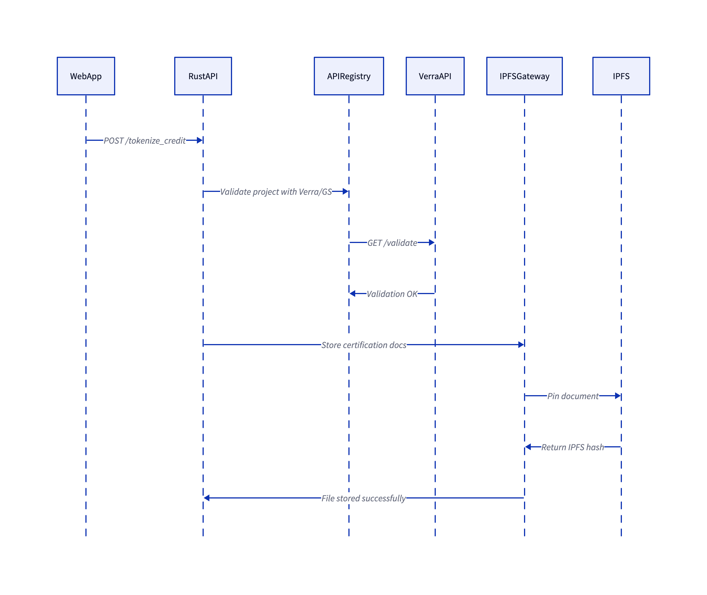
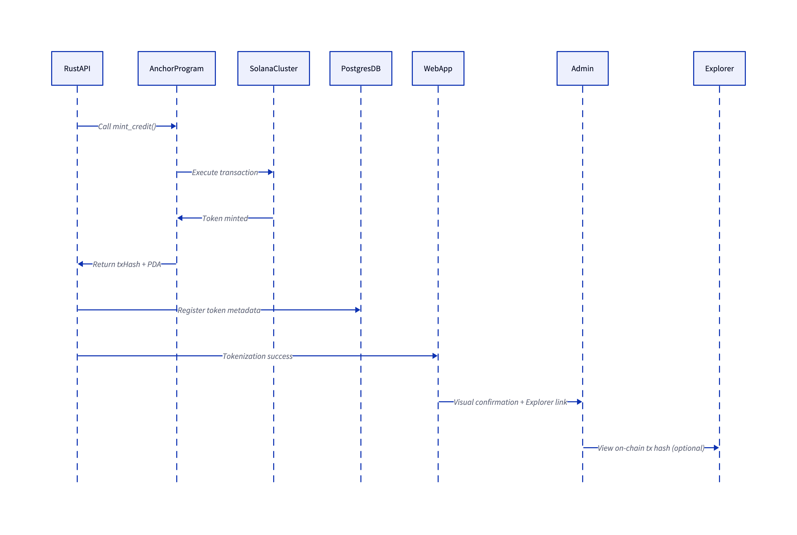

# Sprint 5 – Architecture and Design Report | CarbonPay

## 1. Introduction and Objectives

Sprint 5 focused on formalizing the architectural design of the CarbonPay platform, ensuring traceability, modularity, and robustness to support the functional (FR) and non-functional requirements (NFR) defined in earlier sprints. The objective was to translate the software’s vision into technical constructs that enable safe, efficient, and verifiable tokenization of carbon credits on the Solana blockchain. This sprint also aimed to validate the system design through D2-based modeling (both static and dynamic) and guide architectural decisions using the ATAM (Architecture Tradeoff Analysis Method).

---

## 2. Architecture

### 2.1 Static Architecture Model (Block Diagram)

The CarbonPay platform is structured into five logical domains: **Frontend**, **Backend**, **Blockchain Layer**, **Data Layer**, and **External Services**. This modular architecture promotes maintainability, scalability, and separation of concerns, while also ensuring that functional (FR1–FR12) and non-functional requirements (NFR1–NFR12), as defined under ISO/IEC 25010:2011, are adequately addressed.

Each domain encapsulates a set of components with well-defined responsibilities and communication flows. The architecture is implemented using interoperable technologies such as Solana, IPFS, PostgreSQL, and RESTful APIs, combined with Solana’s smart contract infrastructure (Anchor framework) to ensure full traceability, transparency, and integrity of carbon credit transactions.

#### Static Architecture Diagram

#### Domain Overview and Justification

**Frontend Layer**  
The frontend domain includes the client-side application (built with Next.js and TypeScript), wallet integration modules, dashboards, and public traceability pages. It is responsible for user interaction and flow orchestration. Its main components are:

- `WebApp`: Provides interfaces for project exploration, token acquisition, and emissions tracking.
- `WalletAdapter`: Supports Solana-compatible wallets (e.g., Phantom, Backpack, Solflare), ensuring interoperability (FR8, NFR5).
- `OrgDashboard`: Corporate panel for tracking emission offsets and exporting reports (FR7).
- `PublicExplorer`: Public-facing pages showing proof-of-retirement for tokens, enhancing transparency (FR6, NFR9).

These components are aligned with usability standards (NFR6) and ensure smooth onboarding and accessibility.

**Backend Layer**  
This domain contains the core application logic, middleware, and external integration services. It is implemented in Rust using the Actix Web framework for high performance (NFR1) and testability (NFR4). Components include:

- `RustBackend`: Handles API routing, smart contract invocation, metadata storage, and external service orchestration.
- `AuthService`: Provides authentication and authorization via JWT and RBAC (FR8, NFR3).
- `IPFSGateway`: Connects to IPFS for decentralized document storage, used primarily for certification and retirement proofs (FR1, FR9).
- `AdminPortal`: Interface for administrators to manage credit issuance and audits (FR9).
- `APIRegistry`: Integrates with third-party registries like Verra and Gold Standard to validate project eligibility and status (FR11).
- `AutomationEngine`: Enables configuration and execution of automated offsetting rules (FR5).
- `AuditExport`: Generates compliance-ready CSV/JSON exports with signed hashes (FR12, NFR10).

This layer is responsible for coordinating operations and managing the business rules that connect the frontend to the blockchain.

**Blockchain Layer**  
Responsible for executing immutable operations, storing decentralized asset states, and enforcing program logic via smart contracts. This layer includes:

- `AnchorContracts`: Solana smart contracts written in Rust and deployed via the Anchor framework, handling token minting, transfer, and retirement (FR1, FR3, FR4).
- `SolanaCluster`: Execution layer (Devnet during development; Mainnet in production), supporting fast finality and low-cost transactions, ensuring adherence to NFR1 and NFR7.

By offloading critical operations to the blockchain, CarbonPay guarantees non-repudiation and auditability (NFR9).

**Data Layer**  
This domain is responsible for off-chain data persistence and indexing:

- `PostgresDB`: Stores project metadata, wallet associations, retirement records, and user profiles, supporting dashboard visualizations and API queries (FR2, FR7, FR12).
- `IPFS`: Decentralized storage system used to host certification documents and audit logs, ensuring verifiability and tamper resistance (NFR9, NFR10).

PostgreSQL was chosen for transactional reliability, and IPFS for decentralized integrity verification of attached documentation.

**External Services**  
To ensure regulatory alignment and traceability, CarbonPay interacts with third-party registries:

- `VerraAPI` and `GoldStandardAPI`: Interfaces used for validating project metadata and certification status (FR11), essential for compliance with regulated frameworks (NFR10).

This layer enforces external validation standards and supports potential adoption in regulated carbon markets.

#### Architectural Rationale

Each functional requirement (FR) is fulfilled by a combination of components that collaborate across domains. For example:

- FR1 (Tokenization) is handled by the AdminPortal, RustBackend, AnchorContracts, IPFSGateway, and IPFS.
- FR3 (Token Purchase) and FR4 (Retirement) are executed via smart contract functions exposed to the frontend through the backend.
- FR5 (Automated Offset) relies on AutomationEngine’s scheduled logic and token lifecycle control.
- FR6 and FR12 are supported by publicly verifiable proofs and compliance-friendly exports respectively, anchored on IPFS and chain-linked identifiers.

The architecture supports high modularity (NFR4), enabling isolated testing, replacement, or scaling of components. The use of stateless APIs and decentralized smart contracts provides horizontal scalability (NFR7), while IPFS ensures recoverability of critical files (NFR8).

Furthermore, the architecture was designed to anticipate regulatory shifts. Should regulated markets begin accepting digital credits, the system can incorporate on-chain KYC/KYB verification, issuer whitelisting, or verifiable registry endorsements. These adaptations would primarily affect the AuthService, AuditExport, and APIRegistry components, which were architected with extensibility and policy modularity in mind.

In summary, this static architecture enables CarbonPay to securely tokenize and distribute carbon credits while maintaining operational resilience, transparency, and alignment with global compliance requirements.

---

### 2.2 Dynamic Architecture Model (Sequence Diagrams)

This section focuses on **FR1 – Tokenization of Carbon Credits**, a critical business process that encapsulates multiple steps including data collection, external validation, storage of evidence, smart contract execution, and registry persistence. It is divided into three modular subflows, each with clear preconditions and postconditions.

---

#### Subflow 1 – Tokenization Form Submission (FR1)

This subflow represents the interaction between an administrative user and the frontend application during the initial phase of credit tokenization. The process begins once the admin is authenticated and accesses the token issuance portal.

- **Actors Involved**: `Admin`, `WebApp`, `AuthService`
- **Precondition**: The admin must be logged in with valid credentials.
- **Flow**:
  1. The admin accesses the tokenization interface via the frontend.
  2. The frontend verifies the session using JWT authentication via the `AuthService`.
  3. Upon validation, the platform renders a dynamic form to capture project metadata: certifier (e.g., Verra), CO₂ offset volume, project location, and supporting documents.
  4. The admin submits the form and uploads documentation.
- **Postcondition**: All data is captured and prepared for backend validation in the next subflow.

This stage emphasizes usability and secure access control, enforcing non-functional requirements such as **Usability (NFR6)** and **Security (NFR3)**.

---

#### Subflow 2 – Validation & IPFS Storage (FR1)

This subflow details how the backend processes the tokenization request by verifying the project’s validity against external registries and securely storing documentation.

- **Actors Involved**: `RustAPI`, `APIRegistry`, `VerraAPI`, `IPFSGateway`, `IPFS`
- **Precondition**: The backend has received a valid tokenization request and its payload.
- **Flow**:
  1. The `RustAPI` receives a `POST /tokenize_credit` request from the frontend.
  2. It delegates verification to the `APIRegistry`, which queries the Verra API to ensure the project's authenticity.
  3. Once validated, the `RustAPI` forwards the documentation to `IPFSGateway`, which pins the files to `IPFS` for decentralized storage.
  4. IPFS returns a content-addressed hash, confirming file permanence and retrievability.
- **Postcondition**: The credit is validated, and its supporting evidence is anchored via IPFS, ensuring compliance with **Auditability (NFR9)** and **Legal Traceability (NFR10)**.

This subflow handles potential asynchronous delays (e.g., API latency, IPFS pinning), which are mitigated through event confirmations and error-handling logic.

---

#### Subflow 3 – Minting & Confirmation (FR1)

The final subflow in the tokenization pipeline involves on-chain minting of the tokenized carbon credit and the recording of its metadata in the registry.

- **Actors Involved**: `RustAPI`, `AnchorProgram`, `SolanaCluster`, `PostgresDB`, `WebApp`, `Admin`
- **Precondition**: The certification is validated, and the IPFS hash is available.
- **Flow**:
  1. The `RustAPI` invokes the `mint_credit()` instruction on the smart contract.
  2. The `AnchorProgram` executes the transaction on the `SolanaCluster`, creating a new SPL token.
  3. Upon success, the smart contract returns a transaction hash and a PDA (Program Derived Address) identifying the token.
  4. The backend registers the token metadata, including the IPFS hash, certifier name, and volume, into the `PostgresDB`.
  5. The `RustAPI` notifies the frontend of the success, which confirms the issuance to the admin and optionally provides an explorer link.
- **Postcondition**: The credit is now a live token on-chain, searchable and trackable by the platform and third parties.

This subflow addresses critical aspects of **Blockchain Interaction (FR1)**, **Traceability (FR6)**, and **Performance Efficiency (NFR1)**. It ensures token immutability and full audit trail through Solana transaction logs and stored metadata.

---

## 3. Architectural Justification Using ATAM

The ATAM (Architecture Tradeoff Analysis Method) was applied to evaluate and justify architectural decisions in light of competing quality attributes such as performance, modifiability, security, and compliance. Below is an outline of key tradeoff scenarios and rationales:

- **Decision 1: Use of Solana Blockchain**

  - _Rationale:_ High throughput and low fees support scalability (NFR7) and performance (NFR1). Tradeoff: tight coupling with Solana ecosystem APIs and dev tools.

- **Decision 2: IPFS for Off-chain Document Storage**

  - _Rationale:_ Ensures immutability and decentralized availability of certification files (FR1, FR9). Tradeoff: Slightly higher latency during retrieval compared to traditional storage.

- **Decision 3: Anchor + Rust Smart Contract Stack**

  - _Rationale:_ Ensures type safety and secure interaction via IDL (Interface Description Language). Supports integration with backend without exposing internal instruction schemas (FR10). Tradeoff: requires specialized skills and slows onboarding of new developers.

- **Decision 4: Admin and Audit Flows Isolated from Public APIs**

  - _Rationale:_ Reduces surface area for privilege escalation attacks. Supports RBAC enforcement (NFR3). Tradeoff: Increases codebase branching and test matrix.

- **Decision 5: Use of JWT + RBAC for Auth**

  - _Rationale:_ Simplifies session management across frontend/backend. Ensures compatibility across org dashboards, public explorers, and admin modules. Tradeoff: Limited support for revocation unless token lifecycle is tightly scoped.

- **Regulatory Flexibility (Future Adaptation)**
  - The architecture was designed to allow integration with national registries or compliance engines through modular external connectors (APIRegistry). As new regulatory schemas emerge (e.g., Brazilian OCPC10), tokens may require registration hashes and legal anchoring. This modularity ensures CarbonPay can extend its compliance without core redesign.

> Architectural decisions were validated through partial implementations, stress-tested under simulated user flows, and benchmarked for modular upgrades in future sprints. The modular design and layered responsibility model ensure that evolving functional demands (e.g., market regulation, third-party registry integrations) can be adopted with minimal disruption.

---

## References

- INTERNATIONAL ORGANIZATION FOR STANDARDIZATION. _ISO/IEC 25010:2011 – Systems and software engineering – Systems and software Quality Requirements and Evaluation (SQuaRE) – System and software quality models_. Geneva: ISO, 2011.

- INTERNATIONAL ORGANIZATION FOR STANDARDIZATION. _ISO/IEC 10746 – Information technology – Open Distributed Processing – Reference Model (RM-ODP)_. Geneva: ISO, 1998. 4 v.

- KAZMAN, R.; KLEIN, M.; CLEMENTS, P. _Evaluating Software Architectures: Methods and Case Studies_. Boston: Addison-Wesley, 2002.
